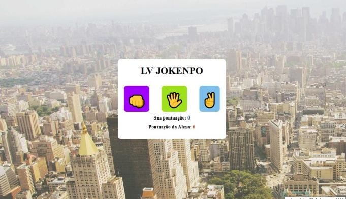

# ✊✋✌️ LV Jokenpô

Um jogo de **Pedra, Papel e Tesoura** desenvolvido para praticar lógica de programação utilizando **HTML, CSS e JavaScript**.



---

## 🚀 Tecnologias utilizadas

- 🌐 HTML5
- 🎨 CSS3
- ⚡ JavaScript

---

## 🎮 Funcionalidades

- Escolha entre Pedra, Papel ou Tesoura.
- A jogada da Alexa é gerada de forma aleatória.
- Sistema de pontuação em tempo real.
- Interface simples, moderna e responsiva.
- Atualização automática do placar após cada rodada.

---

## 📚 O que pratiquei

Durante o desenvolvimento deste projeto, coloquei em prática:

- Manipulação do DOM
- Eventos de clique
- Estruturas condicionais (`if` e `else`)
- Geração de números aleatórios (`Math.random()`)
- Funções em JavaScript
- Atualização dinâmica de elementos da página
- Estilização com CSS

---

## 💻 Como executar

1. Clone este repositório:

```bash
git clone https://github.com/seuusuario/nome-do-repositorio.git
```

2. Abra a pasta do projeto.

3. Execute o arquivo `index.html` no navegador.


---

## 📌 Objetivo

Este projeto foi desenvolvido com o objetivo de fortalecer meus conhecimentos em desenvolvimento Front-End, praticando JavaScript, manipulação da interface e lógica de programação através da criação de um jogo interativo.

---

## 👩‍💻 Desenvolvido por

**Luana Vitória Fustinoni Camargo**

```
